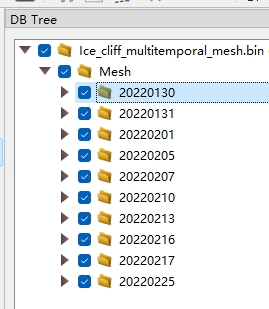
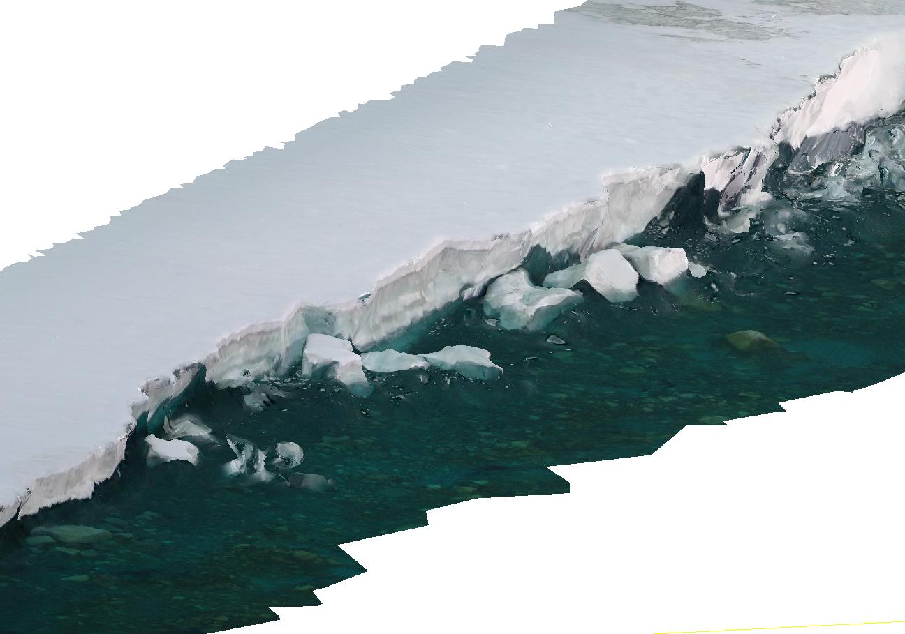
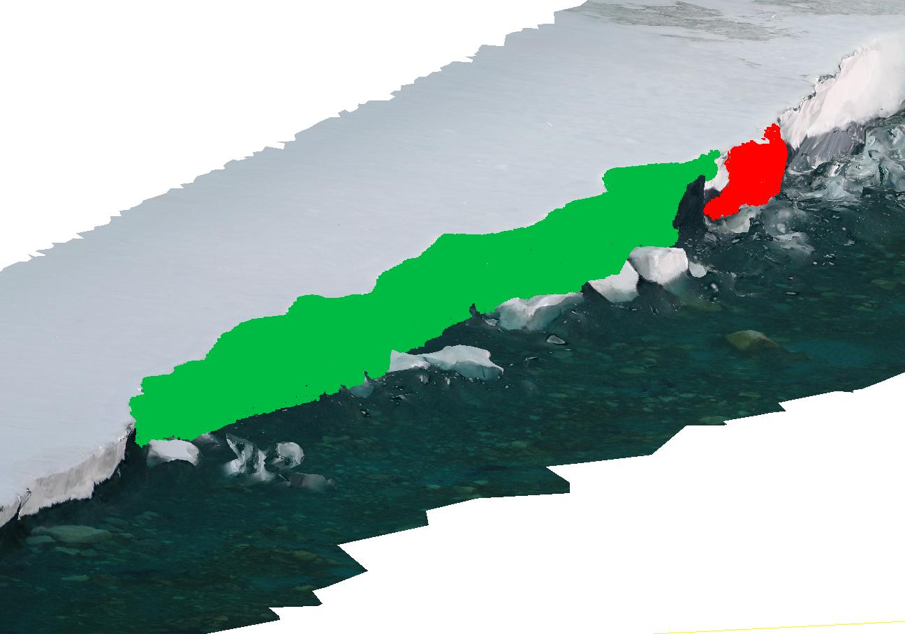

# Introduction
Code and dataset for paper *Fine-scale Antarctic Grounded Ice Cliff 3D Calving Monitoring based on Multi-temporal UAV Photogrammetry Without Ground Control*. 
Ice cliff collapse detection and volume estimation using multitemporal aligned mesh generated from photogrammetry.

Note: Due to the randomness of the clustering algorithm, the results obtained by the code will be slightly different from the results of the paper.

# Requirements
## Software
1. MATLAB (tested on R2023a)
2. [CloudComPy]( https://github.com/CloudCompare/CloudComPy) (tested on v3.9)
## MATLAB file exchange
1. [Triangle/Ray Intersection](https://ww2.mathworks.cn/matlabcentral/fileexchange/33073-triangle-ray-intersection)
2. [LASRead/LASWrite](https://ww2.mathworks.cn/matlabcentral/fileexchange/21434-lasread)

# Dataset
The dataset contains geo-registrated multitemporal meshes recording the calving process of an ice cliff in Antarctica and ice cliff calving detection results. 

## Multitemporal meshes
The meshes were generated from UAV photogrammetry and co-alignment technique. The dataset is a single [CloudCompare](https://www.danielgm.net/cc/) `.bin` file, `Ice_cliff_multitemporal_mesh.bin`. It contains meshes generated by Metashape from each epoch. The file structure is shown in the below image. Each subfoler contains a mesh of the ice cliff at `yyyymmdd` day. 

The ice cliff is located between the Qinling station area $(74^\circ56' S, 163^\circ 42' E)$ and the Nansen Ice shelf, Inexpressive Island in Victoria Land, East Antarctica. The length of its coastline is approximately 0.89 km.

The UAV for collecting aerial images was a DJI Mavic 2 Pro drone, which carries a Hasselblad L1D-20c gimbal camera. Its 28 mm-equivalent lens has a $77^\circ$ field of view (FoV). From 30-Jan
to 25-Feb 2022, 10 flights were performed with the same flight parameters in 26 days. The date of flights were 30-Jan, 31-Jan, 1-Feb, 5-Feb, 7-Feb, 10-Feb, 13-Feb, 16-Feb, 17-Feb and 25-Feb. 

|Parameter name|         Value|
|----------------------| -----------------------------------
Flying height |         100 m
Image front/sidelap  |  80% / 60%
\# of images planned |  330
GSD                  |  2.1 cm
Image coverage       |  159 $\times$ 106 m

## Calving detection results
In the `\result` folder stores a series of point cloud files `mmdd-mmdd_diff.ply`. They are calving object detection results of our paper. The `snow_volume_0.66.xlsx` is a table containing the numerical results of calving detection.
Below are two screenshots showing ice cliff mesh and calving object detection results from our paper.

# Run
## Generate valid space for change detection
1. Set the parameter `STEP` in `CloudComPy_scripts\run_change_detection.py` to 9, and the parameter `path` to the location of `Ice_cliff_multitemporal_mesh.bin`.
2. Run `CloudComPy_scripts\run_change_detection.py` (CloudComPy required), it creates a point cloud file `mmdd-mmdd.las` under the subfolder of `distance_threshold_xx`. This compares the mesh between the first and the last epoch. 
3. Set the `folder` in line 4 of `run_generateValidSpace.m` to the subfolder created in step 2.
4. Run `run_generateValidSpace.m`, it will create a `pointcloudValidSpace.mat` storing the point cloud for valid space in the `export` subfolder.

## Ice cliff change detection and volume calculation 
1. Set the parameter `STEP` in `CloudComPy_scripts\run_change_detection.py` to 1, and the parameter `path` to the location of `Ice_cliff_multitemporal_mesh.bin`.
2. Run `CloudComPy_scripts\run_change_detection.py` (CloudComPy required), it creates a series of point cloud file `mmdd-mmdd.las` under the subfolder of `distance_threshold_xx`. This compares the mesh between each epoch. 
3. Set the `folder` in line 4 of `run.m` to the subfolder created in step 2.
4. Run `run.m`, it will export the calving volume result to the console, and store it to an Excel table. It will also create a series of point cloud file `mmdd-mmdd_diff.ply`. They are calving objects detected by the algorithm. 

